---

date: 2021-06-20
title: "Google IO 2021 : What's new in Jetpack Compose"
categories: Android

---
# What's new in Jetpack Compose

해당 게시글은 Google IO 2021의 세션 중 "What's new in Jetpack Compose"의 내용을 정리한 글 입니다.

https://www.youtube.com/watch?v=7Mf2175h3RQ

Android의 최신 네이티브 UI 도구 키트이며 현재 베타 버전 입니다. 아직까지는 [Beta Build](https://developer.android.com/studio/preview?gclid=CjwKCAjwq7aGBhADEiwA6uGZp6kw5FgnlL7hLn1or-DZ1C6L_4mmgkvhioR-rYccCbYtDsQPrOx2QRoC6ggQAvD_BwE&gclsrc=aw.ds) 에서만 확인 가능하지만, 곧 1.0이 출시됩니다.


Compose는 직관적이고 강력하면서도 처음부터 개발을 가속화 하도록 설계 되었습니다. 훨씬 적은 코드로 UI에 들이는 시간을 아껴 기능을 구현하는데 집중할 수 있습니다.


# 왜 Compose가 나왔을까

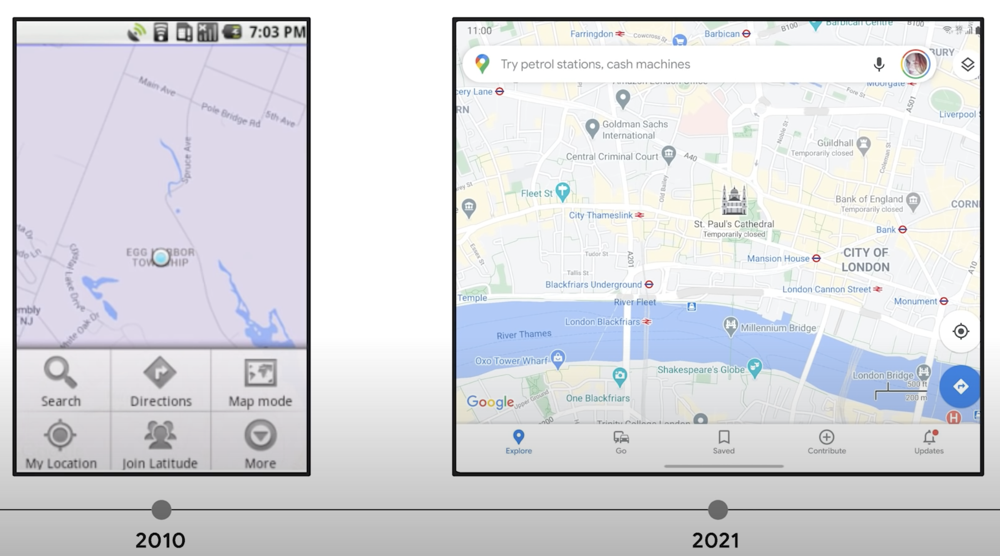

뷰 기반의 기존 툴킷은 10년 넘게 사용되어 왔습니다. 기대 성능이 향상되었고 앱에 대한 기대는 커지고 있습니다. 그렇지만 View 기술 자체는 10년이나 된 기술이라 새로운 UI 도구를 원한다는 생각이 많았습니다. (좋아지긴 해도 근본은 10년전하고 똑같다)

그래서 3년전 부터 구글에서 개발하기 시작하여 올해 2월에 [Android Show](https://www.youtube.com/watch?v=vRjJAWh6JPE) 를 통해 베타가 공개 되었습니다.

# Compose는 왜 빠른가

Compose를 활용하면 UI를 빠르고 쉽게 구축할 수 있습니다. 어떻게 해서 UI를 쉽고 빠르게 구축할 수 있을까요?

Jetpack은 선언적(Declarative) UI도구키트(UI Toolkit) 입니다. 

## 선언적 Declarative

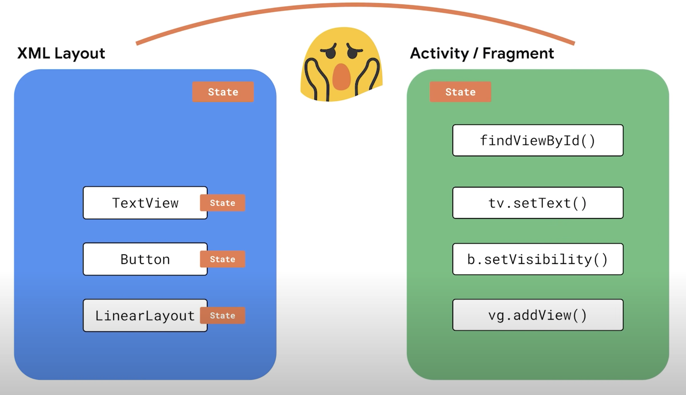

원래는 View를 사용하려면 XML에 UI를 선언해야 했습니다.

앱의 상태나 데이터가 바뀌면 UI 를 업데이트 해야합니다. 뷰 마다 상태가 다르고 각각 업데이트 해야 해서 과정이 복잡했으며 이 과정에서 버그가 발생하기도 합니다.

Compose와 같은 선언적 UI는 이와 다른 방식을 사용합니다. 상태를 UI로 변환 합니다.

UI는 변경할 수 없고 한번 생성하면 업데이트가 불가능 합니다. 앱 상태가 바뀌면 새로운 상태를 새로운 표현으로 변환합니다. 즉 해당 상태에 맞추어 UI 전체를 다시 생성합니다. 그러면 더 비효율적이지 않나 생각하겠지만, Compose는 매우 지능적이고 효율적이어서 변경되지 않은 요소에 대한 작업은 건너뜁니다.

코드는 특정 상태에 대한 UI 를 설명할 뿐 생성 방법을 지정하지 않습니다. 그렇다면 상태를 UI로 어떻게 변환할까요?

```kotlin
@Composable
fun MessageList(message: List<String>) {
  Column {
    messages.forEach { message ->
      Text(text = message)
    }
  }
}
```

위 코드는 문자열 리스트를 나타내는 코드 입니다.

Compose에서 UI구성 요소는 구성 가능한 주석이 달린 함수일 뿐입니다. 그래서 UI 구성 요소를 빠르고 쉽게 생성할 수 있습니다.

재사용 가능한 요소로 구성된 라이브러리로 UI를 나누는 것이 좋습니다. 이 함수는 값을 반환 하는 대신 UI를 전달합니다.

이 코드는 텍스트를 수직으로 배열하고(Column), 간단한 텍스트 레이블(Text)을 표시합니다.

```kotlin
@Composable
fun MessageList(message: List<String>) {
  Column {
    if (messages.size == 0) {
       Text("No messages")
    } else {
			 messages.forEach { message ->
      	Text(text = message)
    	}      
    }
  }
}
```

Kotlin구문과 제어문으로 UI를 생성할 수 있습니다. 메시지가 없다면 `no messages` 라는 레이블을 표시하고 싶다면 if문을 사용하면 됩니다. 

```kotlin
@Composable
fun MessageList(message: List<String>)
```

컴포저블은 데이터를 파라미터로 받아서 UI를 전달합니다. 그러면 UI가 동기화 상태에서 벗어나지 않습니다. 예를 들면 `no message` 를 삭제하지 않는 등의 실수를 하지 않을 수 있습니다. 상태가 바뀌거나 리스트가 바뀌었을 때 이 함수를 실행하면 새 UI가 생성됩니다. 이를 "ReComposing"이라고 합니다.

메시지 리스트는 어떻게 바뀔까요?

```kotlin
@Composable
fun ConversationScreen() {
  val viewModel: ConversationViewModel = viewModel()
  val messages by viewModel.messages.observeAsState()
  TitleToolBar()
  MessageList(messages)
}

@Composable
fun MessageList(messages: List<String>) {
 // ... 
}

@Composable
fun TitleToolBar() {
 // ... 
}
```

ViewModel이 메시지의 LiveData를 노출합니다. 그리고 `messages` 필드를 읽는 컴포저블은 새 데이터가 입력될 때 마다(observe 될 때 마다) 리컴포저블 됩니다.(다시 호출이 됩니다) observe하는 객체를 추가할 필요가 없습니다. 컴파일러는 입력이 변경된 컴포저블만 다시 실행하고 나머지는 건너뜁니다. 위 코드를 예를 들자면 `messages` 필드가 변경되었다면 `TitleToolBar` 컴포저블은 실행되지 않고 `MessageList(message)` 만 다시 실행이 됩니다.

각 컴포저블은 변경할 수 없습니다. 컴포저블을 참조하거나 쿼리하거나 내용을 업데이트 할 수 없습니다. 컴포저블 외부에서 var, val에 할당을 한다던지, 해당 컴포저블의 state를 변경한다던지의 행동을 할 수 없습니다. 기존 View객체처럼 다룰 수 없습니다. 정보를 입력할 때에는 모두 파라미터로 컴포저블에 전달해야 합니다.

### 이벤트에 의한 Composable 업데이트

다만 컴포저블이 고정되어 있는 것은 아닙니다.

```kotlin
@Composable
fun MessageList(message: List<String>) {
  Column {
    Checkbox(
    	checked = false
    )
  }
}
```

메시지를 선택하는 확인란을 더해 보았습니다. view와 달리 checkbox를 클릭해도 시각적인 변화가 없습니다. 클릭을 해도 항상 체크 안됨 상태인 것이죠. 이것은 상태를 나타내는 값을 상수(false)로 전달했기 때문입니다.

```kotlin
@Composable
fun MessageList(messages: List<String>) {
  Column {
    var selectAll: Boolean = ...
    Checkbox(
    	checked = selectAll,
      onCheckChange = { checked ->
        selectAll = checked
      }
    )
  }
}
```

체크 박스를 클릭하면 `onCheckChange` 이벤트로 갑니다. 여기서 로컬 state를 업데이트 할 수 있습니다. 이렇게하면 state 변경을 인지하고 Checkbox를 다시 그리게 됩니다. `selectAll = checked` state를 업데이트 하는 부분을 제거하면 UI는 다시 그려지지 않습니다.

코드를 작성해야 체크박스를 선택할 수 있다는게 직관적이지 못하다고 생각할 수 있지만, 이게 선언적 UI의 핵심 개념 입니다. 요소로 전달되는 매개변수들이 모두 통제 됩니다. 동기화해야 할 상태를 없애는 거죠. 체크박스 클릭 시 어떻게 반응해야 하냐는 개발자에 따라 달려있습니다. 코드로 모든게 완전히 통제가 되기 때문에 검증이 실패한 시점에 다시 돌아와서 변경을 취소할 필요가 없습니다. 예를들어 기존에는 특정 조건일 때 체크박스가 변경되지 않도록 해야 할 때 

`체크박스 클릭 -> 조건(네트워크, 데이터베이스, n개 중 m개만 체크 등등 ...)에 어긋남 -> 체크 박스 변경 취소 `

처럼 변경을 취소하는 로직이 있는데 Compose에는 그럴 필요가 없다는 것 입니다.


### Composable에서 변수 유지하기

Compose에서 입력 데이터가 바뀌면 Composable을 다시 실행하는데요, 다시 실행하거나 ReComposition을 하더라도 유지하고 싶은 변수가 있습니다. 그럴때 사용하는 것이 remember 변수 입니다. 이전 실행에서 얻은 값을 기억할 수 있습니다. 해당 값을 다시 활용하여 재할당을 방지하거나 상태에 고정할 수 있습니다.

```kotlin
@Composable
fun MessageList(messages: List<String>) {
  Column {
    var selectAll by remember { mutableStateOf(false) }
    Checkbox(
    	checked = selectAll,
      onCheckChange = { checked -> 
      	selectAll = checked
      }
    )
  }
}
```

해당 코드를 다르게 하면

```kotlin
@Composable
fun MessageList(
  messages: List<String>,
  selectAll: Boolean,
  onSelectAll: (Boolean) -> Unit
) {
  Column {
    Checkbox(
    	checked = selectAll,
      onCheckChange = onSelectAll
    )
  }
}
```

업데이트할 상태를 파라미터로 둘 수 있습니다.


### 선언적 UI의 핵심

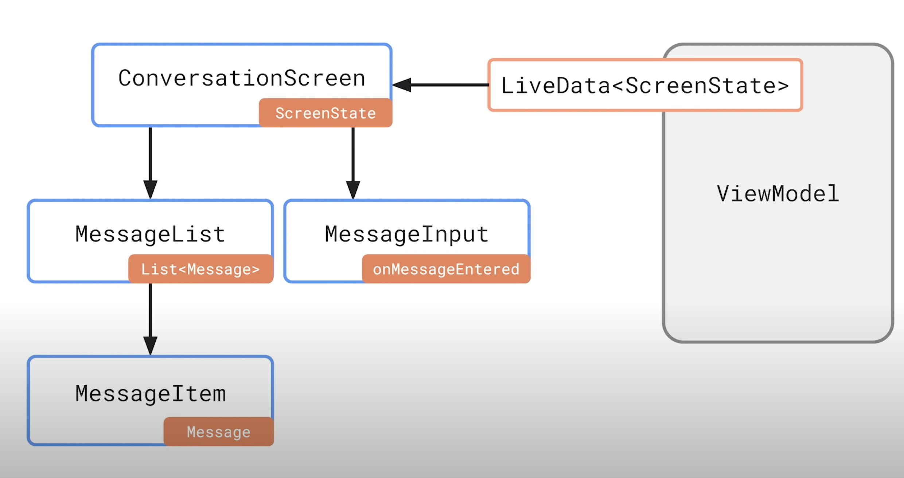

선언적 UI의 핵심은 특정 상태에서 UI의 형태를 완전히 설명하고, 상태가 바뀌면 프레임워크에서 UI 업데이트를 처리합니다.

Compose는 여러가지 애플리케이션 아키텍쳐와 호환되지만, 단방향 데이터 플로우를 따르는 아키텍쳐와 더 잘 맞습니다. ViewModel이 화면 상태의 단일 스트림을 노출하면 Compose UI에서 관찰하고 각 구성요소의 매개변수로 전달합니다.

각 구성요소는 필요한 상태만 수신하므로 데이터를 바꿀 때만 업데이트 하면 됩니다.  

ViewState객체의 단일 스트림을 생성하면 상태 변경을 한 곳에서 처리하는 데 도움이 됩니다. 전체적인 화면 상태를 추론하고 오류를 낮추기 쉽습니다. 이 패턴을 활용하면 간단하게 컴포저블을 테스트할 수 있습니다. 입력에 따라 완전히 제어되기 때문입니다.


## UI 도구키트 UI Toolkit

이러한 원칙에 따라 개발된 Composable은 다양한 UI 구성요소 도구를 제공합니다.

```kotlin
Button() {
  Text("Outlined Button")
}

Card {
  Text("Card Content")
}

FloatingActionButton() {
  Icon(Icons.Filled.Favorite)
}

TopAppBar(
//...
)
```


Jetpack Compose는 Material 디자인 구성요소와 테마 시스템을 구현하며 이에 필요한 구성 요소를 제공합니다. Buttons, Cards, FloatingActionButton, AppBars 등이 해당됩니다. 

```kotlin
MaterialTheme(
	colors = JetnewsColors,
	typography = JetnewsTypography,
	shapes = JetnewsShapes) {
	// ...	
}
```


모든 구성요소들은 기본적으로 Material을 따르고 Material Theme를 구현하기 때문에 모든 구성 요소를 맞춤설정할 수 있습니다.


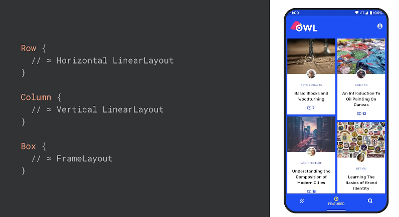

Compose는 간단하지만 강력한 새로운 레이아웃 시스템을 제공합니다.

행과 열을 기반으로 하여 가로와 세로 선형 레이아웃과 비슷하다고 보시면 됩니다.

View시스템과는 달리 Compose레이아웃 모델은 여러 척도들을 전달할 수 없어서 중첩된 레이아웃에 적합합니다.

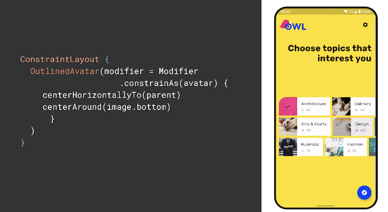

새로운 Compose DSL(Domain-Specific Languages)을 적용한 ConstraintLayout을 사용하면 더 복잡한 레이아웃을 표현할 수 있지만, 맞춤형 레이아웃도 훨씬 간단하게 구현합니다.

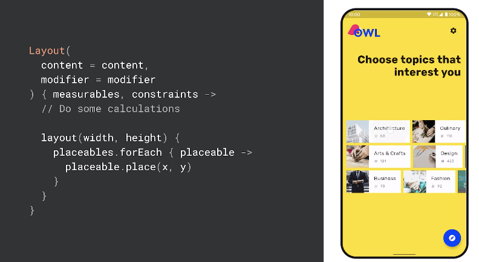

척도와 배치를 직접 설정해서 적절한 레이아웃을 만들고 싶다면 함수를 구현하기만 하면 됩니다.

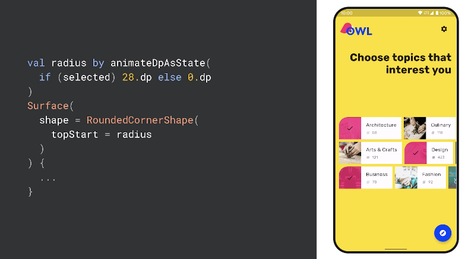

가장 기대가 큰건 새로운 애니메이션 시스템 입니다. 훨씬 간단하게 사용할 수 있고, 보다 효과적이고 간단하게 적용할 수 있습니다. Compose에 MotionLayout을 가져오는 작업도 진행되고 있습니다. [CodeLab에서 확인하기](https://developer.android.com/codelabs/jetpack-compose-animation). 

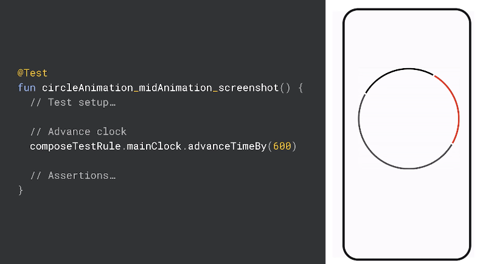

Compose에서는 테스트 기능을 극대화 하는 전용 테스트 기능을 제공합니다. 그리고 독립적으로 컴포저블을 테스트 하는 간편한 API를 제공합니다. 애니메이션을 테스트 할 때에도 테스트를 완전히 통제할 수 있습니다. [CodeLab에서 확인하기](https://developer.android.com/codelabs/jetpack-compose-testing)


## Compose is entirely written in Kotlin

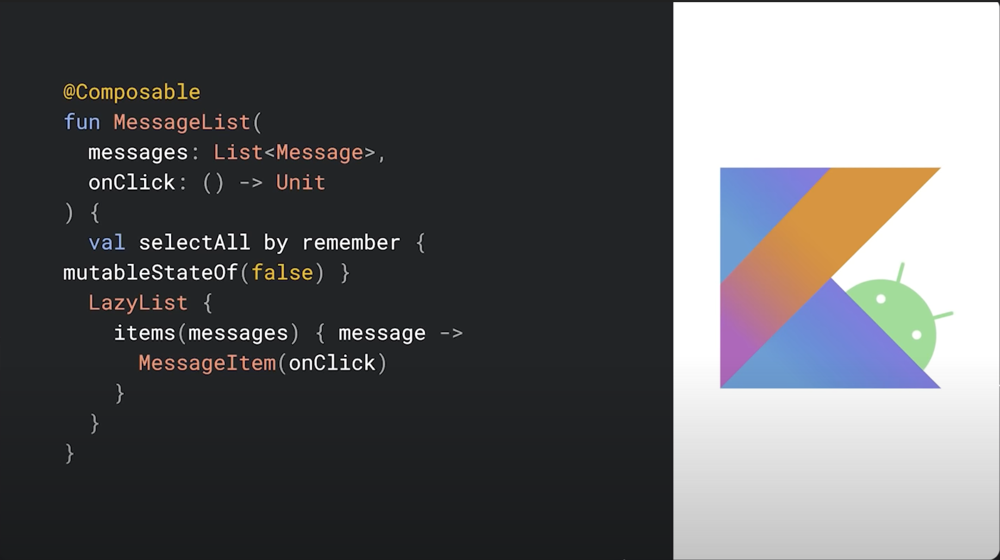

Compose는 Kotlin으로만 개발 되었고, 우수한 언어기능을 활용해 강력하고 간결하면서도 직관적인 API를 구축할 수 있습니다.

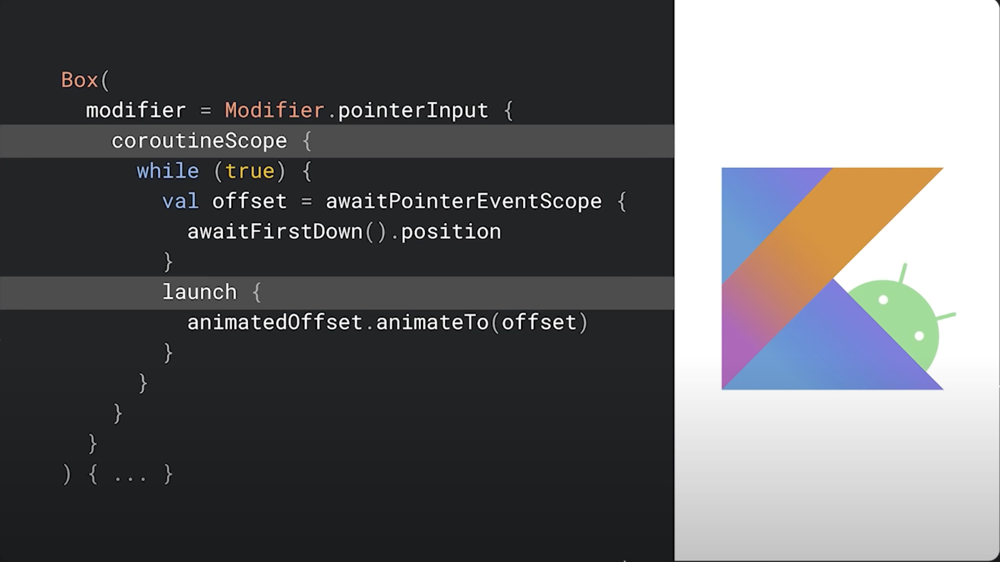

코루틴을 사용하면 간단한 비동기식 API를 작성할 수 있습니다. 제스처를 애니메이션으로 핸드오프 하는 것 처럼 비동기식으로 결합칸 코드를 간단하게 작성할 수 있습니다.  

UI 구성요소를 새로운 함수로 추출해서 간단하게 재사용 할 수 있습니다.

## Example

위에서 소개한 Coroutine을 어떻게 활용하는지 Github에 있는 샘플인 Owl을 통해서 알아봅시다. [Github에서 확인](https://github.com/android/compose-samples/tree/main/Owl)

```kotlin
@Composable
fun TopicChip(topic: Topic, selected: Boolean) {
  Card {
    Row {
      Image(topic.image)
      Text(
        text = topic.name
        modifier = Modifier.padding(16.dp)
      )
    }
  }
}
```


주제칩을 작성해 봅니다. 새로운 구성 가능한 함수를 작성할텐데요, topic model 객체를 매개변수로 받습니다.

이미지와 텍스트가 있는 행으로 구성 요소를 구축할 수도 있습니다. 그러면 topic 객체에 데이터가 보입니다. 배경에서 Card 컴포저블로 행을 감살 수 있습니다. 

간격을 추가하려면 modifier 매개변수로 컴포저블을 장식하면 됩니다.  레이아웃, 그림, 상호작용등을 맞춤 설정하기 위한 다양한 modifier들이 있습니다. 여기서는 padding modifier를 활용하여 간격을 추가 하였습니다.

주제를 선택하면 이미지 위에 체크 아이콘이 표시되도록 하려고 합니다. 그렇다면 selected라는 Boolean 파라미터를 추가 합니다.

```kotlin
@Composable
fun TopicChip(topic: Topic, selected: Boolean) {
  Card {
    Row {
      Box {
      	Image(topic.image)  
        if (selected) {
          Icon(Icons,Filled.Done)
        }
      }
    }
  }
}
```

이미지를 Box로 감싸서 항목 위로 겹겹히 쌓고 선택한 매개변수에 따라 조건부로 아이콘을 추가할 수 있습니다.

```kotlin
@Composable
fun TopicChip(topic: Topic, selected: Boolean) {
  val radius by animateDpAsState( if (selected) 20.do else 0.dp )
  Card(
  	shape = RoundedCornerShape(topStart = radius)
  ) {
    // ...
  }
}
```

선택된 항목은 모서리가 둥글어야 하기 때문에 RoundedCornerShape를 활용하여 corner설정하여 Card의 shape로 전달합니다.

이걸 Animation으로 바꾸려면 조건문을 animateAsState함수로 감쌉니다. 모서리 크기 변경에 애니메이션이 적용 되었습니다.

지금까지는 한 topic을 다루는 ui를 작성했는데요, 이제 topic 목록을 받는 새로운 컴포저블을 작성해 보겠습니다.

```kotlin
@Composable
fun TopicsList(topics: List<Topic>) {
  LazyColumn(modifier = modifier) {
    items(topics) {
      topic -> TopicChip(topic)
    }
  }
}
```

Composable은 [LazyColumn](https://developer.android.com/jetpack/compose/lists#lazy)을 제공합니다. 일반 Column처럼 요소를 수직으로 나열하지만 표시 영역에만 구성하여 뷰를 보여줍니다. 이것은 RecyclerView와 유사합니다. 대량의 데이터 세트를 표시할 때 효율적입니다. 

객체 목록을 items 블록으로 전달하고 각 항목을 랜더링 하는 방법을 전달 할 수 있습니다. 각 항목은 이전에 작성한 TopicChip에서 처리하게 됩니다.

```kotlin
Layout(
	content = content,
  modifier = modifier
) { mesurables, constraints ->
	layout(width, height) {
    placeables.forEach { placeable ->
      placeable.place(x, y)
    }
  }
}
```

Compose에서 맞춤 레이아웃을 구축할 수 있습니다. 코드 몇 줄이면 그리드도 구현할 수 있습니다.


```kotlin
@Composable
fun TopicsScreen() {
  YellowTheme {
    Scaffold(backgroundColor = MaterialTheme.colors.surface) {
      TopicList()
    }
  }
}
```

마지막으로 테마 입니다. Owl 은 테마에서 노란색 배경을 가져 옵니다. 

```kotlin
@Composable
fun YelloTheme(content: @Composable () -> Unit) {
  val colors = if (isSystemInDarkTheme()) {
    YellowThemeDark
  } else {
    YellowThemeLight
  }
  MaterialTheme(colors, content)
}
```

Compose에서는 앱이 다크모드에도 반응하도록 테마를 설정할 수 있습니다. 시스템이 어두운 테마인지 검사하고 색상표를 전환합니다. Compose에는 모든 테마가 런타임에서 실행되기 때문에 기본 테마 외에도 동적 테마도 손쉽게 지원합니다. [CodeLab에서 확인하기](https://developer.android.com/codelabs/jetpack-compose-theming)


## Jetpack와 View의 호환

Jetpack Compose는 기존 View 시스템과 호환 됩니다. [Codelab에서 확인하기](https://developer.android.com/codelabs/jetpack-compose-migration)

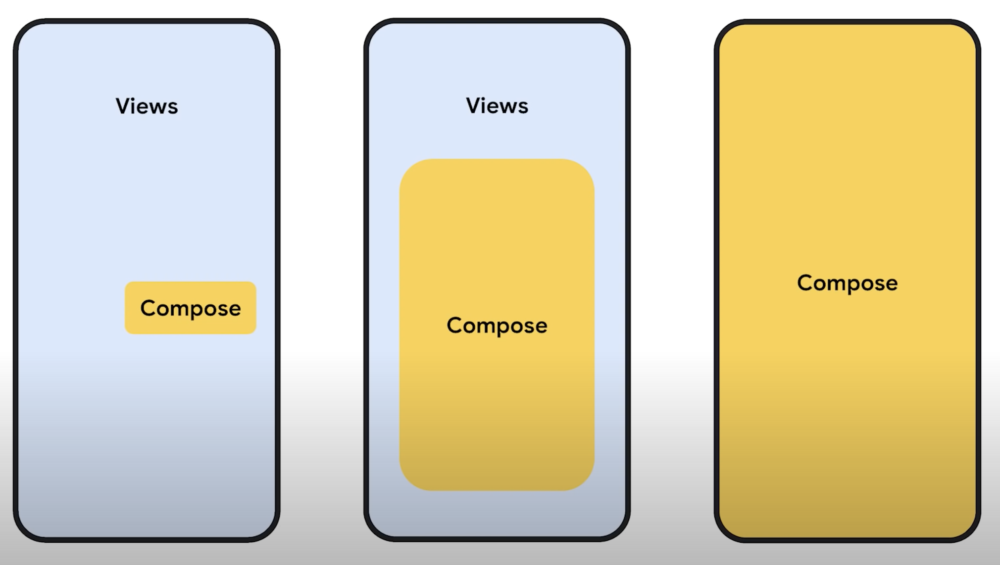

화면의 작은 요소 부터 시작해서 UI의 큰 부분이나 화면 전체를 교체 하면 됩니다. Compose는 필요한 단계를 진행할 수 있도록 도와 줍니다.


```xml
<androidx.core.widget.NestedScrollView
    android:id="@+id/plant_detail_scrollview"
    android:layout_width="match_parent"
    android:layout_height="match_parent"
    android:clipToPadding="false"
    android:paddingBottom="@dimen/fab_bottom_padding"
    app:layout_behavior="@string/appbar_scrolling_view_behavior">
   
  <androidx.compose.ui.platform.ComposeView
        android:id="@+id/compose_view"
        android:layout_width="match_parent"
        android:layout_height="match_parent"/>

</androidx.core.widget.NestedScrollView>
```

예를 들자면 기존 레이아웃에 ComposeView를 활용하여 [View에서 Compose를 포함할 수 있고](https://developer.android.com/codelabs/jetpack-compose-migration#4),


```kotlin
@Composable
private fun PlantDescription(description: String) {
    val htmlDescription = remember(description) {
        HtmlCompat.fromHtml(description, HtmlCompat.FROM_HTML_MODE_COMPACT)
    }

    AndroidView(
        factory = { context ->
            TextView(context).apply {
                movementMethod = LinkMovementMethod.getInstance()
            }
        },
        update = {
            it.text = htmlDescription
        }
    )
}
```

아직 HTML처리, mapView 같이 Composable에서 처리할 수 없는 기능을 활용하기 위해 [Compose에서 View를 호스팅 할 수 있습니다](https://developer.android.com/codelabs/jetpack-compose-migration#8). 이는 Compose로 점차 옮겨 가면서 원하는 대로 도입할 수 있을 것 입니다.


## 다른 주요 라이브러리와 통합

View와의 상호 운용성 외에도 Navigation, ViewModel, LiveData, Rx, Flow, Paging, Hilt 같은 다른 주요 라이브러리와의 통합을 제공합니다. Compose는 기존 아키텍쳐와도 호환이 되어서 처음부터 시작할 필요가 없습니다.

공통 이미지 로딩 라이브러리에서는 래퍼를 제공하고 [Glide for Compose](https://google.github.io/accompanist/glide/), Material 또는 AppCompat Xml 테마를 Compose로 제공할 때는 어댑터를 제공합니다. 자세한 것은 "[Using Jetpack libraries in Compose](https://www.youtube.com/watch?v=0z_dwBGQQWQ)" 에서 다뤄지고 있습니다.


## Compose 지원 도구

개발자의 환경은 강력한 도구와 종합적 문서가 없으면 완전하다고 할 수 없습니다. 그래서 Layout Inspecter 과 같은 친숙한 도구를 Compose를 지원하도록 업데이트 했을 뿐만 아니라 새 도구도 구현 하였습니다.

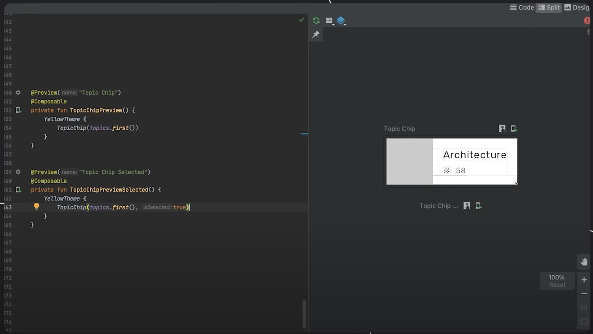예를 들면 Compose Preview에서는 구성요소와 함께 미리보기를 정의할 수 있습니다. 별도의 `@Preview` Compose를 활용하면 독립적으로 반복 개선하고 애니메이션을 구현할 수 있습니다. 

다른 지원도구는 [What's new in Android Development Tools](https://www.youtube.com/watch?v=WRNWzhrl6-s), [What's new in Design Tools](https://www.youtube.com/watch?v=B1u7JZ1rLyE) 에서 확인할 수 있습니다.


## 마치며

미리 Compose를 사용한 사람들의 평가에 따르면 코드를 줄일 수 있어서 코드 베이스 용량이 축소되었다고 합니다.

방금전에 보셨던 리스트의 코드들을 보면 구현해야할게 얼마나 줄었는지 실감이 가실 것 입니다. 아주 간단한 리스트를 작성하려고 해도 RecyclerView의 Adapter을 구현해야 하며 ViewHolder와 itemView 레이아웃을 작성해야 합니다. 하지만 Compose를 작성하게 되면 간단한 Compose를 하나만 작성하면 됩니다.

이렇게 구현해야 할 코드가 줄어들게 되니 기능과 품질에 투자할 시간 여유가 생깁니다. 또한 덜 귀찮고 재미있게 작업할 수 있습니다.

Compose는 최신 도구 키트이며 웨어러블을 비롯한 소형 폼팩터에서 태블릿, 크롬북과 같은 대형 폼팩터까지 다양한 화면을 지원합니다.

[여기서 설명드린 Compose는 CodeLab를 통해 체험할 수 있습니다.](https://developer.android.com/courses/pathways/compose)

